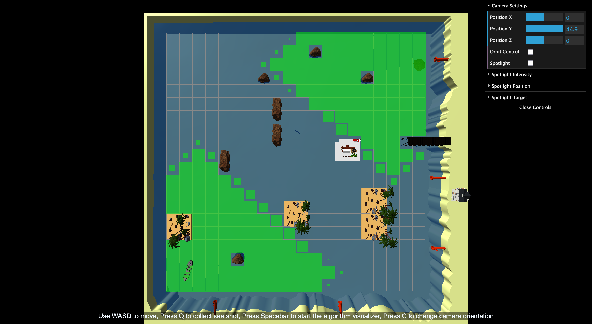

# Mucilage Cleaning Simulator

A Project for our Computer Graphics course with the theme of "Solutions for Environmental Issues". Its main purpose is implementing and animating a common computer science algortihm in a gamificated way. Our algorithm of choice was **Bidirectonal Breadth First Search**.

Try to collect wastes from the sea, you may use;
- *Bidirectonial BFS* to find the shortest path between the ship and the nearest waste,
- change lighting, its intensity, position and target via GUI,
- change camera position to third person position to bird's eye view



### Tech Stack

* WebGL2
* HTML5
* Javascript
* Three.js

## Requirements

Node.js

## Running

```bash
npm install
```
```bash
npm run dev
```

## Controls

- Use WASD to move
- Press Space for algorithm animation
- Press C for changing camera orientation
- Press Q for collect sea snot & mucilage.